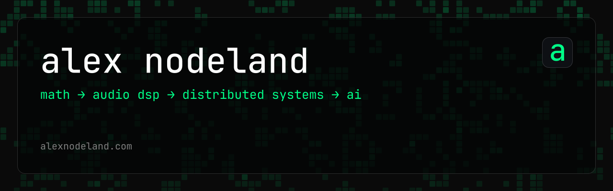

simple parts, explicit rules, emergent wholes ✨

---

i'm alex, an ai engineer and mathematician.

currently senior ai engineer at [perch insights](https://perchinsights.com), working on agent orchestration, evaluation infrastructure, and semantic data models. also run [our nature](https://ournature.studio) with my partner, a creative studio where we explore composition as emergence 🌿

before this i co-founded and ran a supercomputing startup in singapore, and led engineering at a music-ml company soundcloud later acquired. math background: applied math, then a phd in computational methods i left to start a company.

i work mostly in python and write rust on weekends. into probabilistic programming, agent system design, category theory, graphs, human-computer interaction, evolutionary algorithms, audio synthesis.

learning cantonese 🀄, watching birds 🐦, constructing sounds 🎹

[alexnodeland.com](https://alexnodeland.com) · [alex@ournature.studio](mailto:alex@ournature.studio)

this repo is the site and a small model trained on it: [`apps/web`](apps/web) is the gatsby site, [`apps/model`](apps/model) fine-tunes a 14mb tool-calling model into the intent router behind its chat. `just --list` shows both.

the code here is [mit licensed](LICENSE). the writing, the cv, and the images are mine and are not.
